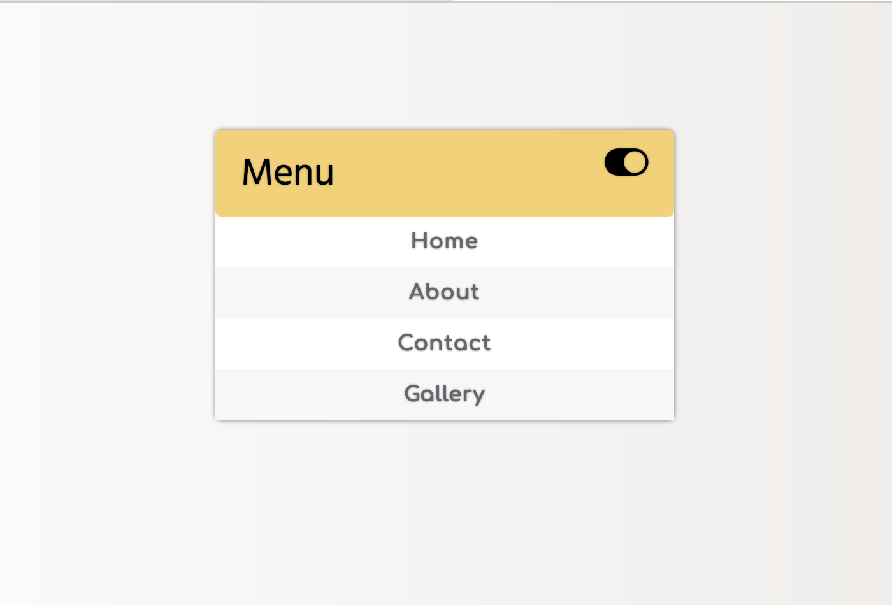
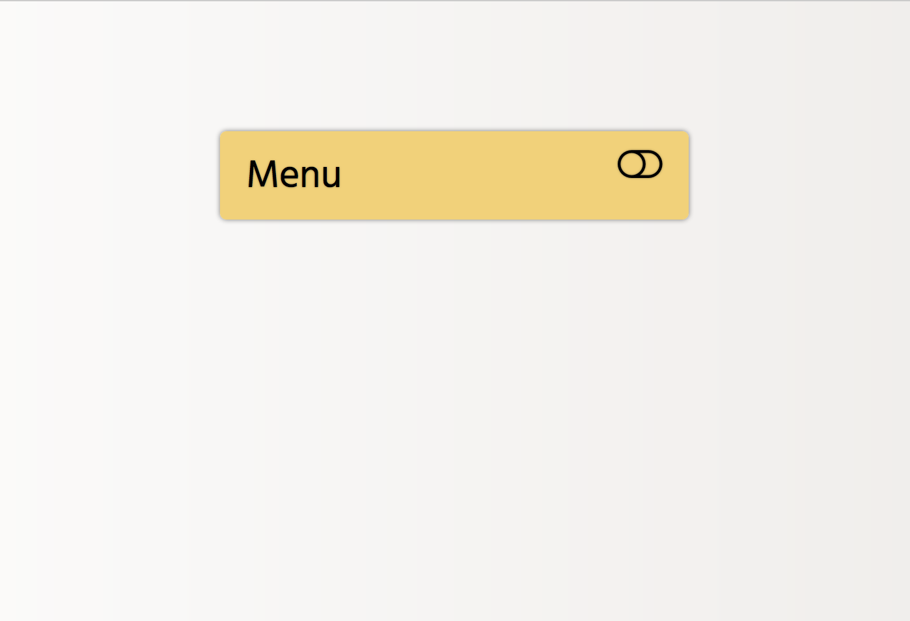
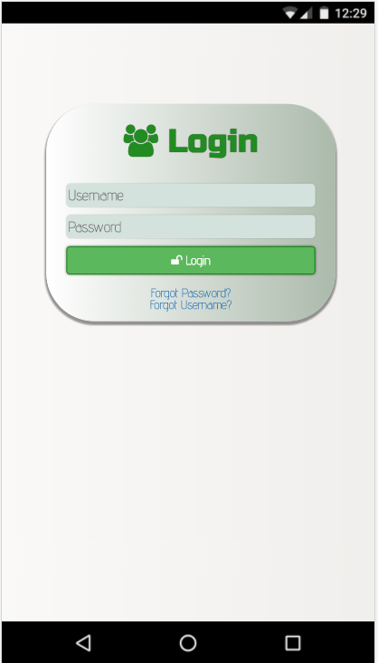

# UIConcepts
UI samples designed by me
* Menu Concept
* Login Concept
* * *
## 1. Menu concept
- __Click on this [link](https://codepen.io/navneetkarnam/pen/dWPjRb) to see a demo__
- A simple slide in and slide out menu concept.
- click on the toggle button to slide in and slide out the menu.
- Each menu item has a shake animation effect when hovered over them.
* * *
### Menu when opened

* * *
### Menu when closed

* * * 
## 2. Login Concept
- __Click on this [link](https://codepen.io/navneetkarnam/pen/NgmqmB) to see a demo__
* * *
### Login Screenshot on a Nexus5x

